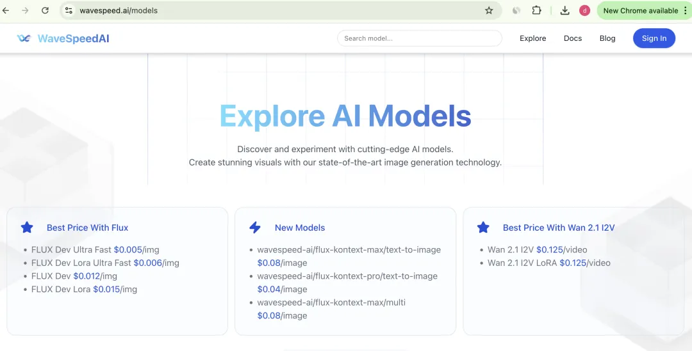
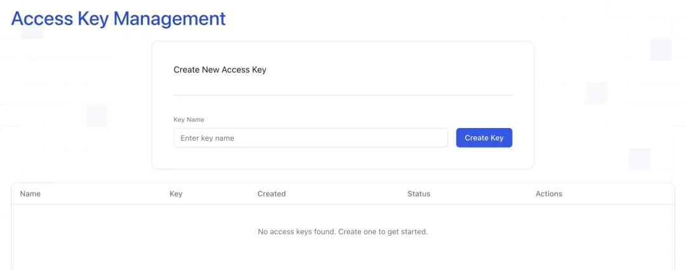
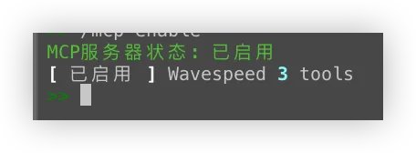
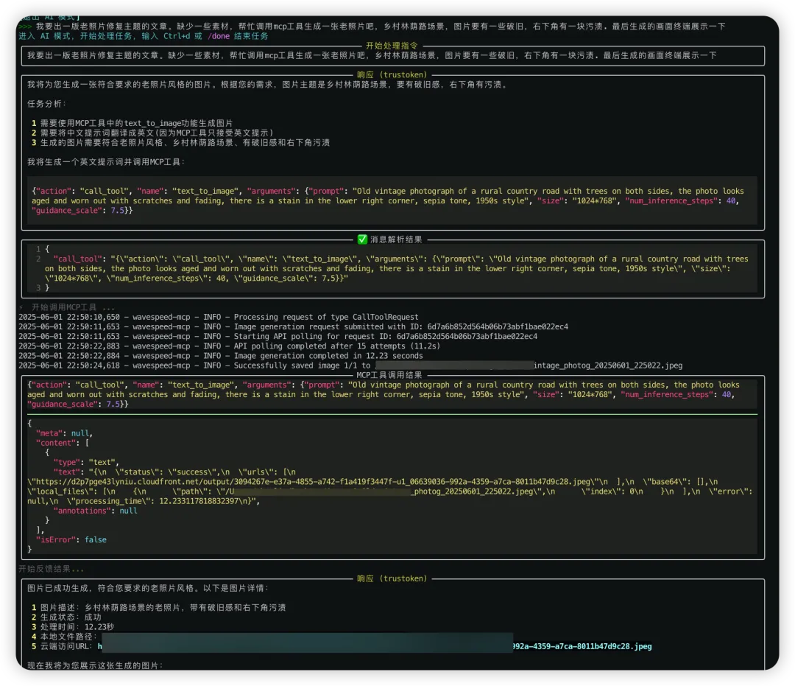
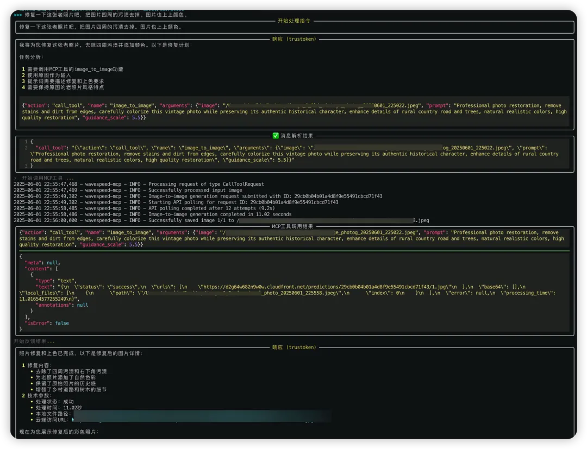
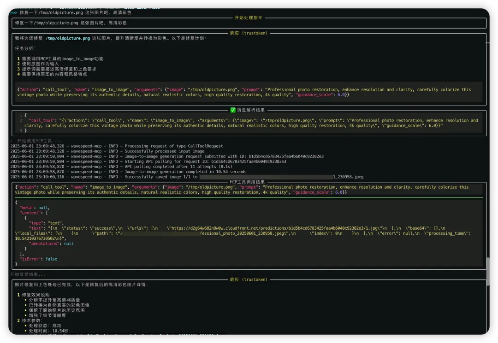
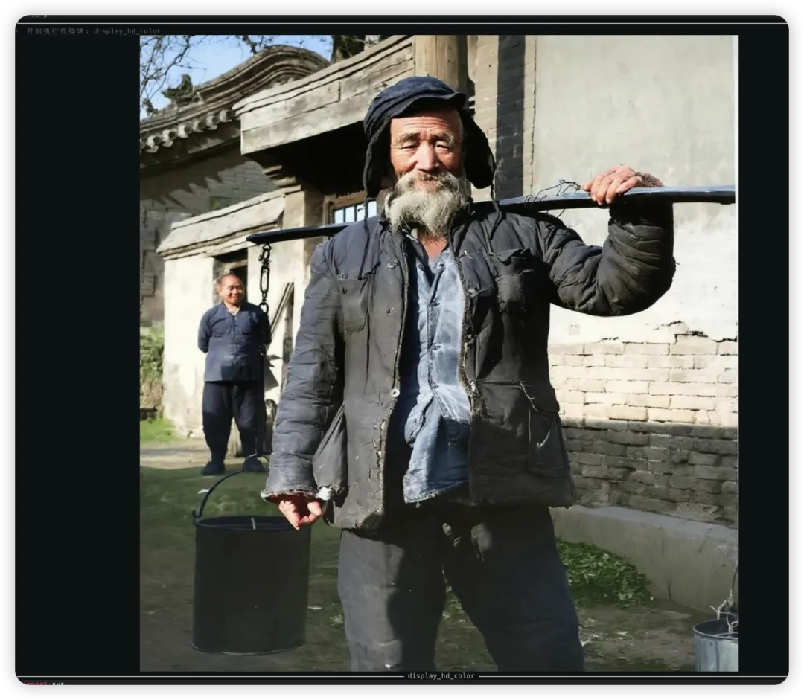
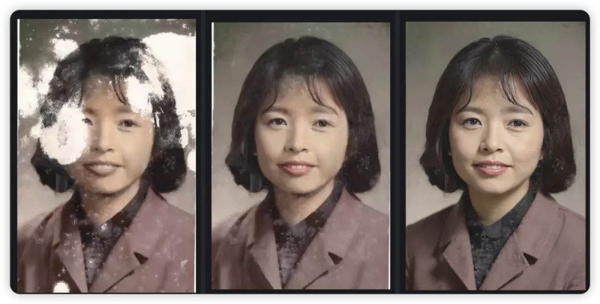

# FLUX.1 Kontext MCP: Restore Old Photos Through Chat — Edit Anything, Anywhere

> **Note**: This document contains multiple images stored in the local `asset` folder and referenced using relative paths.
> 
> **Viewing Options**:
> 1. Clone the repository and view in a local Markdown viewer
> 2. Read the text descriptions in the document, as most steps include detailed explanations

## 1. Introducing FLUX.1 Kontext

FLUX.1 Kontext is a professional **image-to-image editing model** developed by Black Forest Labs, designed for **intelligent contextual understanding** and **precise image manipulation**. It supports a wide range of editing tasks without requiring complex prompts, including object modification, style transformation, background replacement, character consistency editing, and text editing.

FLUX.1 Kontext's core strengths lie in its **exceptional contextual understanding and ability to maintain character consistency**. It ensures that key elements—such as character features and compositional layouts—remain stable even after multiple rounds of editing.

Additionally, both the **FLUX.1 Kontext Pro** and **FLUX.1 Kontext Max** versions of the API are now available as paid offerings. Black Forest Labs says it will soon release the open source FLUX.1 Kontext Dev.

- **FLUX.1 Kontext Pro**: Ideal for editing, compositing, and creative regeneration.
- **FLUX.1 Kontext Max**: Optimized for advanced typography, prompt precision, and editing speed.
- **FLUX.1 Kontext Dev**: Coming soon.

## 2. Introducing WaveSpeed MCP: Empowering Agent Multimodality

WaveSpeedAI is a global leading platform in multimodal AI acceleration, **integrating the most advanced AI video and image generation models**. We provide efficient, secure, and reliable solutions, empowering developers and enterprises to accelerate creation and commercialization.

### Seamless Integration, Enhanced Agent Capabilities

**WaveSpeed MCP** empowers any agent—such as those built on large language models like DeepSeek—to effortlessly gain image and video generation abilities through a standardized interface, enabling truly multimodal interaction.

### Professional-Grade Output Quality

- **High-Quality Images**: Rich in detail, diverse in style, and ready for professional creative use.
- **Smooth Video Animation**: 24fps high frame rate ensures fluid and natural motion.
- **Diverse Style Support**: From realistic to abstract, Western to Eastern aesthetics—tailored to a variety of creative needs.

### Simplified Development Workflow

Developers don't need to master the complexities of image and video generation. With simple integration via MCP, agents can be instantly equipped with powerful visual creation capabilities.

### Efficient and Reliable

- **Fast Response**: The full generation process completes in just a few seconds.
- **Stable and Consistent**: Standardized interfaces ensure consistent output quality.
- **Scalable**: Supports multiple models and parameter tuning to fit diverse application scenarios.

## 3. Introducing AiPy

**AiPy** is a practical implementation of Python concepts, demonstrating their value and potential in the real world. It serves as your ultimate AI sidekick, providing a Python-powered AI environment that allows for seamless interaction between natural language and code execution.

AiPy stands out with its unique approach of providing the entire Python execution environment to large language models, allowing them to freely use all Python features without predefined tool interfaces. This flexibility enables AI agents to tackle a wide range of tasks with greater autonomy and effectiveness.

However, **AiPy still has some limitations**. For example, during development, if you want it to fetch a website's logo, generate a product promo video, or connect directly to a database to retrieve user data—tasks that involve multimodal processing or real-world execution—AiPy often falls short.

This is exactly where **MCP** makes a difference. It extends AiPy's capabilities beyond reasoning, enabling it to act. With MCP, AiPy evolves from a tool that can "think" to one that can also "do," becoming a truly unified AI assistant that helps developers complete the full loop from intelligent inference to real-world execution.

## 4. Integrating WaveSpeed MCP into AiPy

This guide uses **AiPy** as an example to demonstrate how to add image and video generation capabilities using **WaveSpeed MCP**. Before you begin, please ensure you have the following prerequisites:

### Download AiPy and Log In

If you're not already familiar with AiPy, you can download it from the official [website](https://www.aipy.app/). After installation, follow the setup instructions to get started.

### Set Up WaveSpeedAI Account

WaveSpeedAI is the world's fastest and most cost-effective AI platform for image and video generation.

If you don't already have an account, you can create one [here](https://wavespeed.ai).



Sign up with GitHub or Google and get $1 instantly.


Get Access Key.



### Install the WaveSpeedAI MCP

Simply install the MCP client provided by WaveSpeedAI. For more details about the implementation, refer to our documentation.

🔗 [WaveSpeedAI MCP Server](https://github.com/WaveSpeedAI/mcp-server)

If you're new to MCP, think of it as an AI orchestrator that coordinates multiple large models and tools to automate complex tasks, enabling AI to not just process information but also take action.

```bash
pip install wavespeed-mcp
```

You can check the version information after installation.

```bash
pip show wavespeed-mcp
```

## 5. Configuration of AiPy

In AiPy's configuration directory, create a new file named `mcp.json`, enter the following content (be sure to replace `WAVESPEED_API_KEY`), and save it:

```json
{
  "mcpServers": {
    "Wavespeed": {
      "command": "wavespeed-mcp",
      "env": {
        "WAVESPEED_API_KEY": "<YOUR_WAVESPEED_API_KEY>"
      }
    }
  }
}
```



After creating the configuration file, open AiPy and enter the following command to enable the newly created MCP:

```
/mcp enable
```

This command will list the available MCP services; the first time you run it, there may be a brief loading delay.

## 6. Start and Try FLUX.1 Kontext

After configuration, enter AiPy commands in the terminal to enable MCP and start chatting with the agent. The following examples demonstrate the capabilities of FLUX.1 Kontext for photo restoration.

### Example 1: Restore an AI-generated old photo

#### Step 1: Use FLUX Dev to generate an old-style image

**Prompt:**
```
Use the MCP to generate an old picture, a country boulevard scene, the picture should be a little worn and have a stain in the lower right corner. The final generated image should be displayed in the terminal.
```

**Agent Running Process:**



**Result:**


*Tip: Include 'display the final image in the terminal' in your prompt.*

#### Step 2: Use FLUX.1 Kontext to test restoration

**Prompt:**
```
Restore this old photo by removing the stains around the edges and adding color to the image.
```

**Agent Running Process:**



**Result:**


### Example 2: Restore a real old photo

Find an old photo on a website and see what MCP can do.


Place the image at `/tmp/oldpicture.png`

**Prompt:**
```
Please restore the image at /tmp/oldpicture.png — make it high-resolution and in color.
```

**Agent Running Process:**



**Result:**



With just a few simple prompts, you can easily recover damaged old photos.

Below are a few more restoration examples to show the magic of one-click photo repair:




## 7. Try FLUX.1 Kontext now!

WaveSpeedAI and AiPy allow developers to unleash their creativity and complete the highest quality multimodal creations in the least amount of time.

Try it now and start creating efficiently!

🔗 [WaveSpeed MCP Link](https://github.com/WaveSpeedAI/mcp-server)
🔗 [AiPy Link](https://www.aipy.app/)

If you're interested in agent integration or evaluation, we warmly invite you to join us.
🔗 [https://github.com/WaveSpeedAI/agent-mcp-lab](https://github.com/WaveSpeedAI/agent-mcp-lab)

📲 Follow us on Twitter, LinkedIn and join our Discord channel to stay updated.
