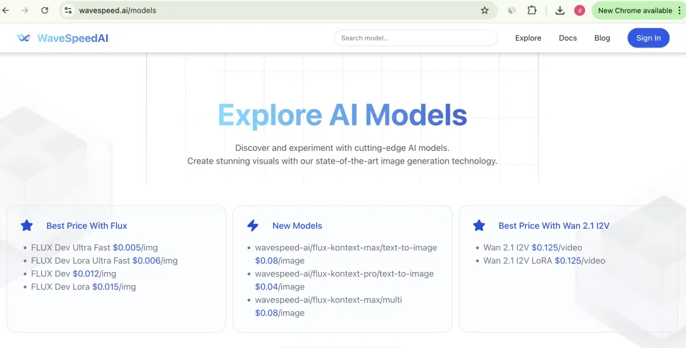
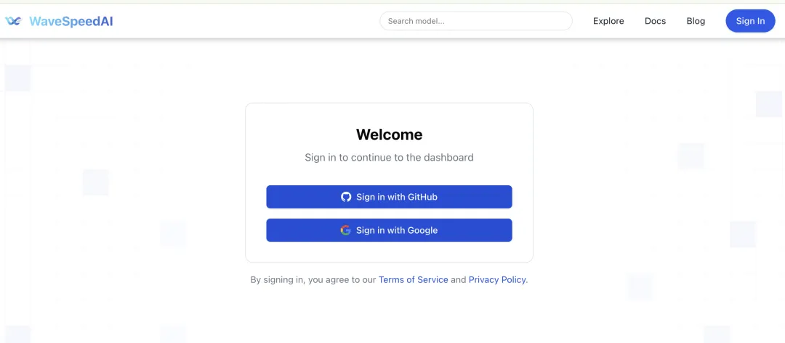

# FLUX.1 Kontext MCP Global Debut: Instantly Unlock Real-Time Multimodal Power in Windsurf

> **Note**: This document contains multiple images stored in the local `asset` folder and referenced using relative paths.
> 
> **Viewing Options**:
> 1. Clone the repository and view in a local Markdown viewer
> 2. Read the text descriptions in the document, as most steps include detailed explanations

## 1. Introducing FLUX.1 Kontext

FLUX.1 Kontext is a professional **image-to-image editing model** developed by Black Forest Labs, designed for **intelligent contextual understanding** and **precise image manipulation**. It supports a wide range of editing tasks without requiring complex prompts, including object modification, style transformation, background replacement, character consistency editing, and text editing.

FLUX.1 Kontext's core strengths lie in its **exceptional contextual understanding and ability to maintain character consistency**. It ensures that key elements—such as character features and compositional layouts—remain stable even after multiple rounds of editing.

Additionally, both the **FLUX.1 Kontext Pro** and **FLUX.1 Kontext Max** versions of the API are now available as paid offerings. Black Forest Labs says it will soon release the open source FLUX.1 Kontext Dev.

- **FLUX.1 Kontext Pro**: Ideal for editing, compositing, and creative regeneration.
- **FLUX.1 Kontext Max**: Optimized for advanced typography, prompt precision, and editing speed.
- **FLUX.1 Kontext Dev**: Coming soon.

## 2. Introducing WaveSpeed MCP: Empowering Agent Multimodality

WaveSpeedAI is a global leading platform in multimodal AI acceleration, **integrating the most advanced AI video and image generation models**. We provide efficient, secure, and reliable solutions, empowering developers and enterprises to accelerate creation and commercialization.

### Seamless Integration, Enhanced Agent Capabilities

**WaveSpeed MCP** empowers any agent—such as those built on large language models like DeepSeek—to effortlessly gain image and video generation abilities through a standardized interface, enabling truly multimodal interaction.

### Professional-Grade Output Quality

- **High-Quality Images**: Rich in detail, diverse in style, and ready for professional creative use.
- **Smooth Video Animation**: 24fps high frame rate ensures fluid and natural motion.
- **Diverse Style Support**: From realistic to abstract, Western to Eastern aesthetics—tailored to a variety of creative needs.

### Simplified Development Workflow

Developers don't need to master the complexities of image and video generation. With simple integration via MCP, agents can be instantly equipped with powerful visual creation capabilities.

### Efficient and Reliable

- **Fast Response**: The full generation process completes in just a few seconds.
- **Stable and Consistent**: Standardized interfaces ensure consistent output quality.
- **Scalable**: Supports multiple models and parameter tuning to fit diverse application scenarios.

## 3. Introducing Windsurf

**Windsurf** is a new AI programming assistant developed by the Codeium team, designed to enhance developers' productivity through deep integration with AI technologies. It excels in contextual understanding, toolchain integration, and intelligent code assistance, while also offering a wide range of features and flexible collaboration modes. Like Cursor, Windsurf provides access to GPT-4o and Claude 3.5 Sonnet models — completely free to use.

However, **Windsurf still has some limitations**. For example, during development, if you want it to fetch a website's logo, generate a product promo video, or connect directly to a database to retrieve user data—tasks that involve multimodal processing or real-world execution—Windsurf often falls short.

This is exactly where **MCP** makes a difference. It extends Windsurf's capabilities beyond reasoning, enabling it to act. With MCP, Windsurf evolves from a tool that can "think" to one that can also "do," becoming a truly unified AI assistant that helps developers complete the full loop from intelligent inference to real-world execution.

## 4. Integrating WaveSpeed MCP into Windsurf

This guide uses **Windsurf** as an example to demonstrate how to add image and video generation capabilities using **WaveSpeed MCP**. Before you begin, please ensure you have the following prerequisites:

### Download Windsurf and Log In

If you're not already familiar with Windsurf, you can download it from the official [website](https://windsurf.com). After installation, log in using your preferred authentication method.

### Set Up WaveSpeedAI Account

WaveSpeedAI is the world's fastest and most cost-effective AI platform for image and video generation.

If you don't already have an account, you can create one [here](https://wavespeed.ai).






Get Access Key.


### Install the WaveSpeedAI MCP

Simply install the MCP client provided by WaveSpeedAI. For more details about the implementation, refer to our documentation.

🔗 [WaveSpeedAI MCP Server](https://github.com/WaveSpeedAI/mcp-server)

If you're new to MCP, think of it as an AI orchestrator that coordinates multiple large models and tools to automate complex tasks, enabling AI to not just process information but also take action.

```bash
pip install wavespeed-mcp
```

You can check the version information after installation.

```bash
pip show wavespeed-mcp
```

## 5. Configuring Windsurf

**Step 1:** Launch the Windsurf IDE and click the gear icon in the upper right corner to access the settings panel, then search for 'MCP'.


**Step 2:** Configure the MCP Server. When redirected to the MCP list, click Add. In the MCP marketplace that appears, locate the "Configure Manually" option below the search box and click it.


**Step 3:** Configure your WAVESPEED_API_KEY.

On the configuration page, enter the following JSON:

Note: `WAVESPEED_API_RESOURCE_MODE` accepts one of three values: `"url"`, `"base64"`, or `"local"`. The default is `"url"`.

```json
{
  "mcpServers": {
    "Wavespeed": {
      "command": "wavespeed-mcp",
      "env": {
        "WAVESPEED_API_KEY": "<YOUR_WAVESPEED_API_KEY>"
      }
    }
  }
}
```

Click Confirm to complete the configuration process.

## 6. Getting Started with FLUX.1 Kontext

With your newly configured agent in Windsurf, you can generate images or videos with a single click.
The following examples demonstrate the capabilities of FLUX.1 Kontext.

### Start: Creating an Image with FLUX Dev

**Prompt:**

A man dressed in a classic suit, wearing a dark jacket paired with a striped shirt, holding a vintage microphone with a confident and elegant posture and a warm smile on his face. The composition keeps the man in sharp focus, perfectly highlighting his charming retro charisma and strong stage presence. The overall scene incorporates cinematic lighting effects, with meticulously detailed elements, creating a vibrant and joyful atmosphere.

**Agent Running Process:**


**Result:**


### Use FLUX.1 Kontext and See the Showcase

#### Showcase 1: FLUX.1 Kontext Change Background

**Prompt:** Change the background to a party.

**Agent Running Process:**


**Result:**


*Note: Images are automatically uploaded and optimized based on the prompt text.*

#### Showcase 2: FLUX.1 Kontext Change of Style

**Prompt:** Transform to cartoon style.

**Agent Running Process:**


**Result:**


#### Showcase 3: FLUX.1 Kontext Add Text

**Prompt:** Add "must-listen-to album" as title.

**Agent Running Process:**


**Result:**


#### Showcase 4: FLUX.1 Kontext Text Editing

**Prompt:** Change the title to "never gonna give you up"

**Agent Running Process:**


**Result:**


#### Showcase 5: FLUX.1 Kontext Posture Change

**Prompt:** Change model posture: give a thumbs up, remove the microphone.

**Agent Running Process:**


**Result:**


#### Showcase 6: FLUX.1 Kontext Semantic Understanding

**Prompt:** Make it an album cover in a music store

**Agent Running Process:**


**Result:**


## 7. Start Using FLUX.1 Kontext Today

WaveSpeedAI and Windsurf Agent empower developers to unleash their creativity and produce high-quality multimodal content with unprecedented efficiency.

Start creating today!

🔗 [WaveSpeed MCP Repository](https://github.com/WaveSpeedAI/mcp-server)

📲 Connect with us:
- [Twitter](https://x.com/wavespeed_ai)
- [LinkedIn](https://www.linkedin.com/company/wavespeed-ai/)
- [Discord Community](https://discord.com/invite/yH8a3J4Vcd)
